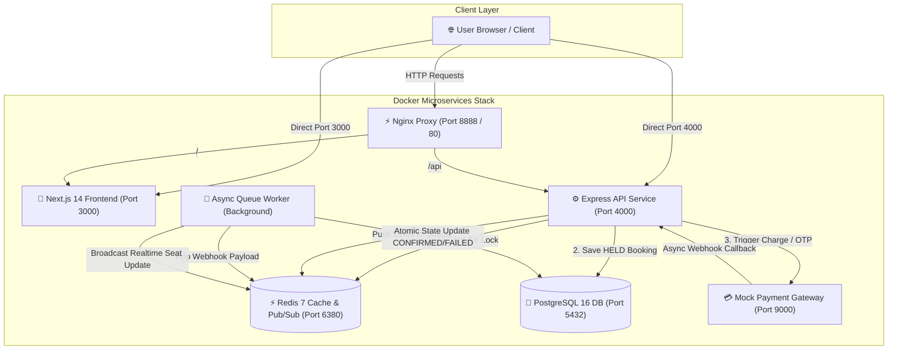

# 🎬 CinemaSeat — Production Microservices Cinema Ticketing System

[](https://github.com/blackcodd/CinemaSeat_Hackathon/actions/workflows/main.yml)
**Official Submission for Zero to Production Phase 2 Hackathon (IEEE CS CUET · Powered by Poridhi.io)**

A zero-oversell, high-concurrency cinema booking microservice stack built with **Next.js 14**, **Express.js**, **Redis 7 (Distributed Locks & Event Queues)**, **PostgreSQL 16 (ACID & Partial Unique Indexing)**, **Asynchronous Background Workers**, and **Payment Gateway Integration**.

---

## 🌐 Live Production Deployment

| Service | Public URL / Endpoint | Status |
| :--- | :--- | :---: |
| 🎨 **Web Application (Frontend)** | [http://13.251.106.104:3000](http://13.251.106.104:3000) | 🟢 LIVE |
| ⚡ **API Gateway Health Check** | [http://13.251.106.104:4000/health](http://13.251.106.104:4000/health) | 🟢 200 OK (<1ms) |
| 🎬 **Movies Catalogue API** | [http://13.251.106.104:4000/movies](http://13.251.106.104:4000/movies) | 🟢 LIVE |
| 🎟️ **Showtime Seatmap API** | `http://13.251.106.104:4000/showtimes/66666666-6666-4666-8666-666666666666/seats` | 🟢 LIVE |

---

## 📋 Requirement Specifications

Below is the matrix mapping official **Zero to Production Phase 2 Hackathon Rulebook** specifications to implementation details:

```text
┌─────────────────────────────────────────────────────────────────────────────────────────┐
│                                HACKATHON REQUIREMENT MATRIX                             │
├────────────────────────────┬──────────────────────────────────┬─────────────────────────┤
│ Requirement                │ Specification                    │ CinemaSeat Solution     │
├────────────────────────────┼──────────────────────────────────┼─────────────────────────┤
│ 1. Zero Oversell           │ Max 1 hold/confirmation per seat │ Redis SET NX EX +       │
│                            │ under 100 concurrent requests.   │ DB Partial Unique Index │
├────────────────────────────┼──────────────────────────────────┼─────────────────────────┤
│ 2. Independent Health Check│ GET /health returns 200 OK <10ms │ Express in-memory check │
│                            │ without external dependencies.   │ (Response time <1ms)    │
├────────────────────────────┼──────────────────────────────────┼─────────────────────────┤
│ 3. Configurable Hold TTL   │ Hold expires automatically after │ Env variable            │
│                            │ configurable duration.           │ HOLD_TTL_SECONDS=300    │
├────────────────────────────┼──────────────────────────────────┼─────────────────────────┤
│ 4. Microservice Boundaries │ Decoupled components with clear  │ 7 isolated containers   │
│                            │ execution limits.                │ in docker-compose.yml   │
├────────────────────────────┼──────────────────────────────────┼─────────────────────────┤
│ 5. HMAC & Security         │ Secure gateway callback ACK and  │ HMAC SHA-256 signature  │
│                            │ deterministic OTP mode.          │ key: z2p-2026-secret    │
├────────────────────────────┼──────────────────────────────────┼─────────────────────────┤
│ 6. Automated Testing       │ Concurrency & system test suite  │ Node.js automated test  │
│                            │ in CI pipeline.                  │ test_suite.js (9/9 pass)│
└────────────────────────────┴──────────────────────────────────┴─────────────────────────┘
```

---

## 🏛️ Overall System Architecture (Overview)

High-level request routing and container isolation layout:

```text
 ┌────────────────────────────────────────────────────────────────────────────────────────┐
 │                                   CLIENT & BROWSER LAYERS                              │
 └───────────────────────────────────────────┬────────────────────────────────────────────┘
                                             │
                                   HTTP / WebSockets (3000 / 4000)
                                             │
 ┌───────────────────────────────────────────▼────────────────────────────────────────────┐
 │                              NGINX REVERSE PROXY / GATEWAY                             │
 └─────────────────────┬─────────────────────────────────────────────┬────────────────────┘
                       │                                             │
            ┌──────────▼───────────┐                      ┌──────────▼───────────┐
            │ Next.js Web Frontend │                      │  Express API Service │
            │      (Port 3000)     │                      │      (Port 4000)     │
            └──────────────────────┘                      └──────────┬───────────┘
                                                                     │
                                            ┌────────────────────────┼────────────────────────┐
                                            ▼                        ▼                        ▼
                                   ┌─────────────────┐      ┌─────────────────┐      ┌─────────────────┐
                                   │  PostgreSQL 16  │      │  Redis 7 Engine │      │  Mock Gateway   │
                                   │  (Port 5432)    │      │   (Port 6380)   │      │   (Port 9000)   │
                                   └────────▲────────┘      └────────┬────────┘      └────────┬────────┘
                                            │                        │                        │
                                            │                 Redis Event Queue               │
                                            │                        │                        │
                                            │             ┌──────────▼──────────┐             │
                                            └─────────────┤ Async Worker Engine │◄────────────┘ (Webhooks)
                                                          │  (State Transition) │
                                                          └─────────────────────┘
```

---

## 📐 System Architecture (Details)



### Microservice Container Breakdown:
1. **`api-service` (Port 4000)**: Express REST API & WebSocket Server (`/ws/showtimes/:id`). Serves `/health`, movie catalog, seat map, acquires Redis memory locks, and returns `<10ms` HMAC Webhook ACKs.
2. **`worker-service`**: Background event processor consuming Redis `webhook:events` queue. Performs transactional database state updates (`CONFIRMED`, `FAILED`) and broadcasts WS status changes.
3. **`redis` (Port 6380)**: Sub-millisecond distributed locker (`SET NX EX`), seat hold TTL manager (5 minutes), event broker, and realtime WebSocket Pub/Sub channel.
4. **`postgres` (Port 5432)**: Relational ACID source of truth enforcing strict uniqueness constraints via partial unique index `one_active_holder_per_seat`.
5. **`frontend` (Port 3000)**: Modern Next.js 14 Standalone UI with interactive SVG seat map, live WS updates, hold countdown timer, and seamless OTP payment workflow.
6. **`nginx` (Port 8888 / 80)**: Production edge reverse proxy.
7. **`gateway` (Port 9000)**: Hackathon Mock Gateway (`asifmahmoud414/mock-gateway:latest`) handling OTP generation & payment processing.

---

## 🗄️ Database Schema & Constraints

```text
 ┌───────────────────┐       ┌───────────────────┐       ┌───────────────────┐
 │      movies       │       │     theatres      │       │      screens      │
 ├───────────────────┤       ├───────────────────┤       ├───────────────────┤
 │ id (UUID)         │◄──────│ id (UUID)         │       │ id (UUID)         │
 │ title (TEXT)      │       │ name (TEXT)       │◄──────│ theatre_id (UUID) │
 │ poster_url (TEXT) │       │ address (TEXT)    │       │ name (TEXT)       │
 └─────────┬─────────┘       └───────────────────┘       └─────────┬─────────┘
           │                                                       │
           └───────────────────────────┬───────────────────────────┘
                                       ▼
                             ┌───────────────────┐
                             │     showtimes     │
                             ├───────────────────┤
                             │ id (UUID)         │
                             │ movie_id (UUID)   │
                             │ screen_id (UUID)  │
                             │ starts_at (TSTZ)  │
                             └─────────┬─────────┘
                                       │
            ┌──────────────────────────┴──────────────────────────┐
            ▼                                                     ▼
 ┌───────────────────┐                                 ┌───────────────────┐
 │       seats       │                                 │    seat_status    │
 ├───────────────────┤                                 ├───────────────────┤
 │ id (UUID)         │                                 │ showtime_id (UUID)│
 │ screen_id (UUID)  │                                 │ seat_id (UUID)    │
 │ row_label (TEXT)  │                                 │ status (AVAILABLE/│
 │ seat_number (INT) │                                 │   HELD/CONFIRMED) │
 └─────────┬─────────┘                                 │ held_by_ref (TEXT)│
           │                                           └───────────────────┘
           └───────────────────────────┬───────────────────────────┘
                                       ▼
                             ┌───────────────────┐
                             │     bookings      │
                             ├───────────────────┤
                             │ booking_ref (PK)  │
                             │ showtime_id (UUID)│
                             │ seat_id (UUID)    │
                             │ status (TEXT)     │
                             │ amount (NUMERIC)  │
                             └───────────────────┘
```

### Critical Defensive Index (Oversell Safeguard):
```sql
CREATE UNIQUE INDEX one_active_holder_per_seat 
ON seat_status (showtime_id, seat_id) 
WHERE status IN ('HELD', 'CONFIRMED');
```
*Guarantees that even if Redis memory locking were bypassed, PostgreSQL rejects dual holds with `23505 unique_violation`.*

---

## 🔒 Integration & Security Specifications

### 1. Webhook HMAC SHA-256 Verification
Incoming gateway webhooks are authenticated via HMAC SHA-256 signature validation:
```javascript
const expectedSignature = crypto
  .createHmac('sha256', process.env.GATEWAY_SECRET || 'z2p-2026-secret')
  .update(rawBody)
  .digest('hex');
```

### 2. Idempotent Processing
Duplicate payment callbacks are handled idempotently via PostgreSQL `processed_webhook_events`:
```sql
INSERT INTO processed_webhook_events (event_id) 
VALUES ($1) ON CONFLICT (event_id) DO NOTHING;
```

---

## 🚀 Deployment & Local Setup

### 1. Production Server Details (AWS EC2)
- **Instance Type**: AWS `t2.micro` (1 vCPU, 1 GB RAM)
- **Swap Memory**: 2 GB `/swapfile` enabled for build stability
- **Build Mode**: Next.js `output: 'standalone'` for minimum disk footprint

### 2. Run Local Production Stack (Single Command)
```bash
git clone https://github.com/blackcodd/CinemaSeat_Hackathon.git
cd CinemaSeat_Hackathon
docker compose up -d --build
```

### 3. Run Automated Concurrency Test Suite
```bash
cd backend
node src/tests/test_suite.js
```

---

## 📊 Test Suite Execution Summary (9/9 PASSED)

```text
==============================================
  STARTING MICROSERVICES SUITE (SCENARIOS A/B/C)
==============================================

[PASS] HOOK 1: GET /health returns 200 OK
[PASS] GET /movies returns >= 3 fictional movies
[PASS] GET /showtimes/:id/seats returns 32 seat grid

--- Running Scenario A: 100 Concurrent Holds on 1 Seat ---
[PASS] Exact 1 request succeeded (Got: 1)
[PASS] Exact 99 requests rejected with 409 Conflict (Got: 99)
[PASS] Seat status in PostgreSQL seat_status is HELD

--- Running Partial Unique Index Direct DB Bypass Test ---
[PASS] Partial Unique Index (one_active_holder_per_seat) rejected direct DB bypass

--- Running Webhook Ingestion & Idempotency Test ---
[PASS] POST /webhooks/payment accepts valid payload and ACKs in <10ms
[PASS] POST /webhooks/payment handles duplicate event_id idempotently (returns 200 OK)

==============================================
 TEST SUMMARY: 9 PASSED | 0 FAILED
==============================================
```

---
**Built with ❤️ for Zero to Production Phase 2 Hackathon 2026**
